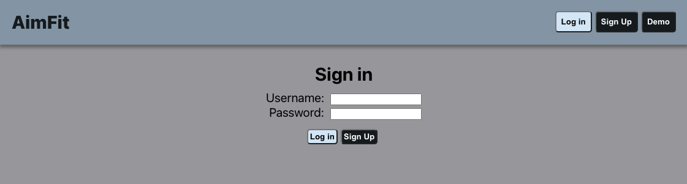
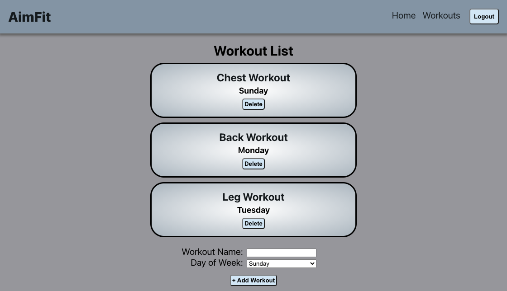
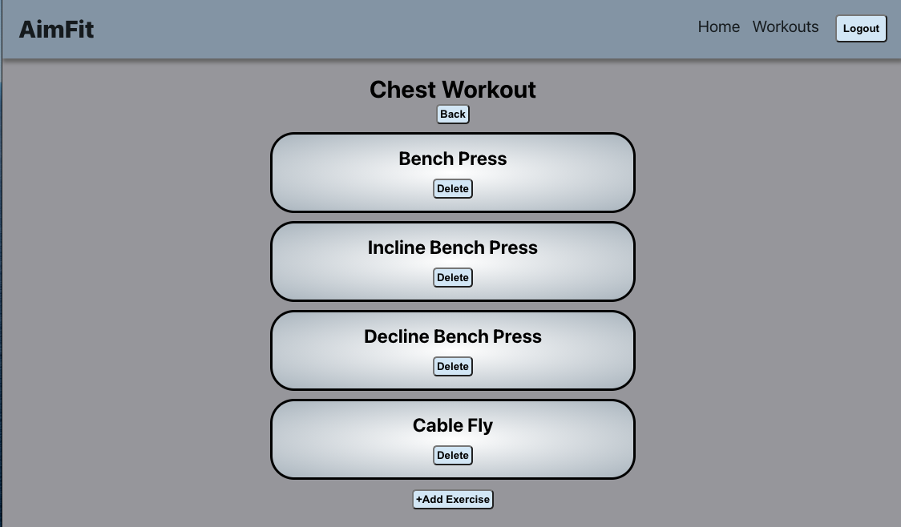
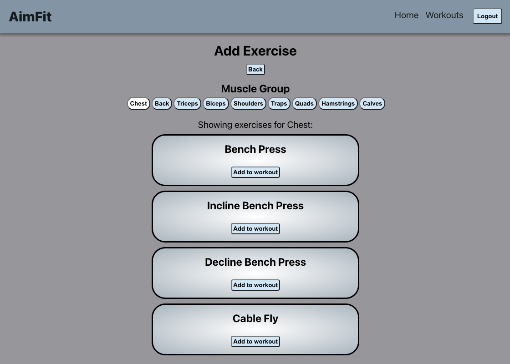

# AimFit
 * * *
 

 ## Live
 --------------

[https://aimfit-app.vercel.app/](https://aimfit-app.vercel.app/)

## Summary
 --------------

 AimFit is a web application that helps you to reach your fitness goals. The application allows the user to create their own workouts and customize the workouts to their needs. The user can also assign a day to each workout to help them organize their weekly workout plan.

 ## Screenshots
  --------------
 Landing Page:
 

 Login Page:
 

 Workout Page:
 

 Workout Exercises Page:
 

 Add Exercise Page:
 

 ## Technologies Used
 --------------

 1. JavaScript
 2. React
 3. HTML
 4. CSS
 5. Jest